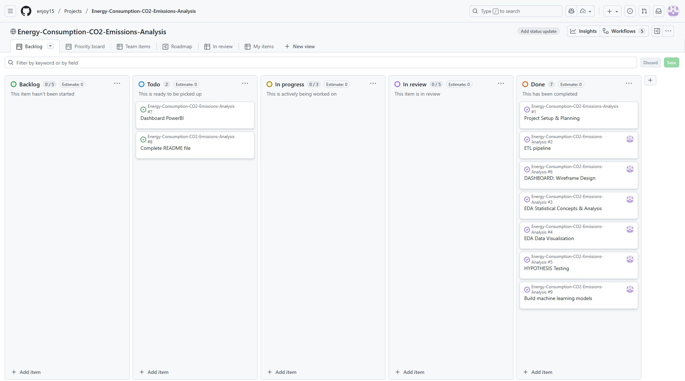

# 

# Energy Consumption and CO2 Emissions Analysis

A comprehensive data analytics and AI project analysing global energy consumption patterns and CO2 emissions from 1980 to 2020, combining statistical analysis, machine learning, and interactive visualisations to support climate policy and sustainable development.

## PowerBI Dashboard & Git Hub
**PowerBI Dashboard:** [View Dashboard](https://github.com/enjoy15/Energy-Consumption-CO2-Emissions-Analysis/tree/main/dashboard)  
**Repository:** [GitHub Repository](https://github.com/enjoy15/Energy-Consumption-CO2-Emissions-Analysis)

  

## Table of Contents

1. [Dataset Content](#dataset-content)
2. [Business Requirements](#business-requirements)
3. [Hypothesis and How to Validate](#hypothesis-and-how-to-validate)
4. [Project Plan](#project-plan)
5. [The Rationale to Map Business Requirements to Data Visualisations](#the-rationale-to-map-business-requirements-to-data-visualisations)
6. [Analysis Techniques Used](#analysis-techniques-used)
7. [Ethical Considerations](#ethical-considerations)
8. [Dashboard Design](#dashboard-design)
9. [Unfixed Bugs](#unfixed-bugs)
10. [Development Roadmap](#development-roadmap)
11. [Main Data Analysis Libraries](#main-data-analysis-libraries)
12. [Credits](#credits)
13. [Acknowledgements](#acknowledgements)

---

## Dataset Content

### Data Sources

**Data Sources:** [Kaggle](https://www.kaggle.com/datasets/lobosi/c02-emission-by-countrys-grouth-and-population)

### Overview

The world is becoming more modernised by the year, and with this becoming all the more polluted.

This data was pulled from the US Energy Administration and joined together for an easier analysis. Its a collection of some big factors that play into C02 Emissions, with everything from the Production and Consumption of each type of major energy source for each country and its pollution rating each year. It also includes each countries GDP, Population, Energy intensity per capita (person), and Energy intensity per GDP (per person GDP). All the data spans all the way from the 1980's to 2020. 

### Feature Descriptions:
* **Country** - Country in question
* **Energy_type** - Type of energy source
* **Year** - Year the data was recorded
* **Energy_consumption** - Amount of Consumption for the specific energy source, measured (quad Btu)
* **Energy_production** - Amount of Production for the specific energy source, measured (quad Btu)
* **GDP** - Countries GDP at purchasing power parities, measured (Billion 2015$ PPP)
* **Population** - Population of specific Country, measured (Mperson)
* **Energy_intensity_per_capita** - Energy intensity is a measure of the energy inefficiency of an economy. It is calculated as units of energy per unit of capita (capita = individual person), measured (MMBtu/person)
* **Energy_intensity_by_GDP**- Energy intensity is a measure of the energy inefficiency of an economy. It is calculated as units of energy per unit of GDP, measred (1000 Btu/2015$ GDP PPP)
* **CO2_emission** - The amount of C02 emitted, measured (MMtonnes CO2)

### Data Schema

| Column Name | Data Type | Description | Example Value | Unit |
|-------------|-----------|-------------|---------------|------|
| Country | String | Country name | "Ukraine", "Germany" | - |
| Energy_type | String | Type of energy source | "coal", "natural_gas", "petroleum_n_other_liquids", "nuclear", "renewables_n_other" | - |
| Year | Integer | Year of observation | 1985, 2010 | Year |
| Energy_consumption | Float | Total energy consumed | 0.005827136 | Normalised units |
| Energy_production | Float | Total energy produced | 0.006560716 | Normalised units |
| GDP | Float | Gross Domestic Product | 527.58 | Billions USD |
| Population | Float | Total population | 14559.38 | Thousands |
| Energy_intensity_per_capita | Float | Energy use per person | 0.983124874980155 | Units per capita |
| Energy_intensity_by_GDP | Float | Energy use per unit of GDP | 0.0 | Units per GDP |
| CO2_emission | Float | Carbon dioxide emissions | 0.0 | Metric tons |

### Energy Types Included

The dataset includes five major energy categories:

1. **Coal** - Traditional fossil fuel, highest CO2 emissions per unit
2. **Natural Gas** - Cleaner fossil fuel alternative
3. **Petroleum and Other Liquids** - Oil-based energy sources
4. **Nuclear** - Low-carbon energy from nuclear fission
5. **Renewables and Other** - Solar, wind, hydro, geothermal, biomass

### Data Characteristics

- **Temporal Coverage:** 40 years (1980-2019) allowing for long-term trend analysis
- **Geographic Diversity:** Multiple countries representing different development stages
- **Energy Mix:** All major energy sources included for comprehensive analysis
- **Economic Context:** GDP data enables economic-energy relationship analysis
- **Demographic Context:** Population data enables per-capita calculations
- **Environmental Impact:** CO2 emissions data for climate impact assessment

### Data Limitations

1. **Aggregated Values:** Original dataset included "all_energy_types" and "World" rows representing sums, which were removed to prevent double-counting
2. **Normalisation:** Energy values are normalised, requiring context for absolute comparisons
3. **Missing Data:** Some countries have incomplete time series, addressed through imputation
4. **Temporal Lag:** Most recent data is from 2019, not real-time
5. **Granularity:** Country-level data only, no sub-national or city-level detail

---
