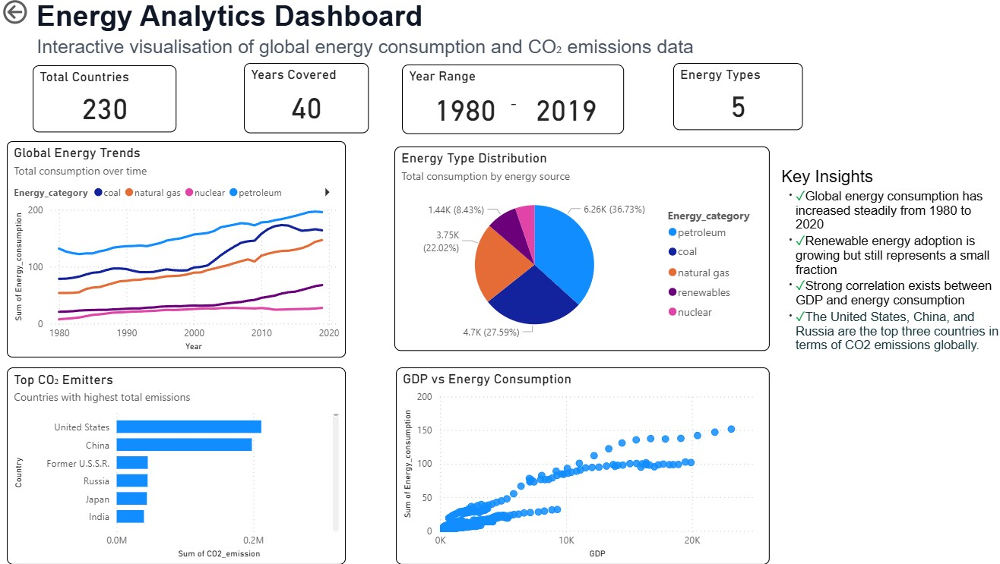

# 

# Energy Consumption and CO2 Emissions Analysis

A comprehensive data analytics and AI project analysing global energy consumption patterns and CO2 emissions from 1980 to 2020, combining statistical analysis, machine learning, and interactive visualisations to support climate policy and sustainable development.

## PowerBI Dashboard & Git Hub
**PowerBI Dashboard:** [View Dashboard](https://github.com/enjoy15/Energy-Consumption-CO2-Emissions-Analysis/tree/main/dashboard)  
**Repository:** [GitHub Repository](https://github.com/enjoy15/Energy-Consumption-CO2-Emissions-Analysis)

<table><tr><td>
  
</td></tr></table>

## Table of Contents

1. [Dataset Content](#dataset-content)
2. [Business Requirements](#business-requirements)
3. [Hypothesis and How to Validate](#hypothesis-and-how-to-validate)
4. [Project Plan](#project-plan)
5. [The Rationale to Map Business Requirements to Data Visualisations](#the-rationale-to-map-business-requirements-to-data-visualisations)
6. [Analysis Techniques Used](#analysis-techniques-used)
7. [Ethical Considerations](#ethical-considerations)
8. [Dashboard Design](#dashboard-design)
9. [Unfixed Bugs](#unfixed-bugs)
10. [Development Roadmap](#development-roadmap)
11. [Main Data Analysis Libraries](#main-data-analysis-libraries)
12. [Credits](#credits)
13. [Acknowledgements](#acknowledgements)

---

## Dataset Content

### Data Sources

**Data Sources:** [Kaggle](https://www.kaggle.com/datasets/lobosi/c02-emission-by-countrys-grouth-and-population)

### Overview

The world is becoming more modernised by the year, and with this becoming all the more polluted.

This data was pulled from the US Energy Administration and joined together for an easier analysis. Its a collection of some big factors that play into C02 Emissions, with everything from the Production and Consumption of each type of major energy source for each country and its pollution rating each year. It also includes each countries GDP, Population, Energy intensity per capita (person), and Energy intensity per GDP (per person GDP). All the data spans all the way from the 1980's to 2020. 

### Feature Descriptions:
* **Country** - Country in question
* **Energy_type** - Type of energy source
* **Year** - Year the data was recorded
* **Energy_consumption** - Amount of Consumption for the specific energy source, measured (quad Btu)
* **Energy_production** - Amount of Production for the specific energy source, measured (quad Btu)
* **GDP** - Countries GDP at purchasing power parities, measured (Billion 2015$ PPP)
* **Population** - Population of specific Country, measured (Mperson)
* **Energy_intensity_per_capita** - Energy intensity is a measure of the energy inefficiency of an economy. It is calculated as units of energy per unit of capita (capita = individual person), measured (MMBtu/person)
* **Energy_intensity_by_GDP**- Energy intensity is a measure of the energy inefficiency of an economy. It is calculated as units of energy per unit of GDP, measred (1000 Btu/2015$ GDP PPP)
* **CO2_emission** - The amount of C02 emitted, measured (MMtonnes CO2)

### Data Schema

| Column Name | Data Type | Description | Example Value | Unit |
|-------------|-----------|-------------|---------------|------|
| Country | String | Country name | "Ukraine", "Germany" | - |
| Energy_type | String | Type of energy source | "coal", "natural_gas", "petroleum_n_other_liquids", "nuclear", "renewables_n_other" | - |
| Year | Integer | Year of observation | 1985, 2010 | Year |
| Energy_consumption | Float | Total energy consumed | 0.005827136 | Normalised units |
| Energy_production | Float | Total energy produced | 0.006560716 | Normalised units |
| GDP | Float | Gross Domestic Product | 527.58 | Billions USD |
| Population | Float | Total population | 14559.38 | Thousands |
| Energy_intensity_per_capita | Float | Energy use per person | 0.983124874980155 | Units per capita |
| Energy_intensity_by_GDP | Float | Energy use per unit of GDP | 0.0 | Units per GDP |
| CO2_emission | Float | Carbon dioxide emissions | 0.0 | Metric tons |

### Energy Types Included

The dataset includes five major energy categories:

1. **Coal** - Traditional fossil fuel, highest CO2 emissions per unit
2. **Natural Gas** - Cleaner fossil fuel alternative
3. **Petroleum and Other Liquids** - Oil-based energy sources
4. **Nuclear** - Low-carbon energy from nuclear fission
5. **Renewables and Other** - Solar, wind, hydro, geothermal, biomass

### Data Characteristics

- **Temporal Coverage:** 40 years (1980-2019) allowing for long-term trend analysis
- **Geographic Diversity:** Multiple countries representing different development stages
- **Energy Mix:** All major energy sources included for comprehensive analysis
- **Economic Context:** GDP data enables economic-energy relationship analysis
- **Demographic Context:** Population data enables per-capita calculations
- **Environmental Impact:** CO2 emissions data for climate impact assessment

### Data Limitations

1. **Aggregated Values:** Original dataset included "all_energy_types" and "World" rows representing sums, which were removed to prevent double-counting
2. **Normalisation:** Energy values are normalised, requiring context for absolute comparisons
3. **Missing Data:** Some countries have incomplete time series, addressed through imputation
4. **Temporal Lag:** Most recent data is from 2019, not real-time
5. **Granularity:** Country-level data only, no sub-national or city-level detail

---

## Business Requirements

### Problem Statement

Climate change represents the defining challenge of our generation, with the energy sector accounting for approximately **73% of global greenhouse gas emissions** (IPCC, 2021) [[1]](#1). Countries worldwide are committed to transitioning from fossil fuels to renewable energy under the Paris Agreement, aiming to limit global warming to 1.5°C above pre-industrial levels.

However, policymakers, energy planners, and climate researchers face significant challenges:

1. **Lack of Accessible Historical Data** - Energy data is scattered across multiple sources and difficult to analyse
2. **Complex Relationships** - Understanding connections between economic growth, population, and energy consumption requires sophisticated analysis
3. **Limited Predictive Tools** - Few tools exist to forecast future energy scenarios based on historical trends
4. **Communication Barriers** - Technical data is difficult to communicate to non-technical stakeholders
5. **Benchmarking Challenges** - Countries struggle to compare their progress against peers

### Target Audience

#### Primary Stakeholders

1. **Government Policy Makers**
   - National energy ministers and climate policy officials
   - Need: Evidence-based insights for setting renewable energy targets
   - Use Case: Benchmark national progress, set realistic transition timelines

2. **Energy Sector Analysts**
   - Energy companies, utilities, and grid operators
   - Need: Market trends and demand forecasting
   - Use Case: Investment decisions, capacity planning

3. **Climate Researchers**
   - Academic institutions and research organisations
   - Need: Historical data for climate models and policy analysis
   - Use Case: Validate climate models, publish research papers

#### Secondary Stakeholders

4. **International Organisations**
   - UN, World Bank, IEA
   - Need: Global progress tracking on climate commitments
   - Use Case: Monitor Paris Agreement compliance, allocate climate finance

5. **General Public and Students**
   - Citizens interested in climate action, students learning about energy
   - Need: Accessible visualisations and educational content
   - Use Case: Understand energy transition, make informed voting decisions

### Business Requirements

#### BR1: Historical Trend Analysis

**Requirement:** Analyse 40 years of energy consumption and CO2 emissions data to identify patterns, trends, and inflection points.

**Success Criteria:**
- Visualise temporal trends for all energy types (1980-2019)
- Calculate growth rates
- Compare renewable vs. fossil fuel adoption rates

**Business Value:** Understand what has worked historically to inform future strategies

---

#### BR2: Statistical Relationship Validation

**Requirement:** Establish and quantify relationships between economic factors (GDP) and energy consumption using rigorous statistical methods.

**Success Criteria:**
- Calculate correlation coefficients with statistical significance (p < 0.05)
- Perform hypothesis testing on key relationships
- Provide confidence intervals for estimates
- Validate assumptions

**Business Value:** Provide evidence-based insights for policy decisions, not just intuition

---

#### BR3: Predictive Modeling

**Requirement:** Build machine learning models to predict future energy consumption and classify energy profiles.

**Success Criteria:**
- Linear regression model for energy consumption prediction
- Clustering model to group countries by energy profile 
- Classification model to identify energy types 
- Cross-validation to ensure model generalisation

**Business Value:** Enable scenario planning and "what-if" analysis for policy makers

---

#### BR4: Interactive Data Exploration

**Requirement:** Create an interactive dashboard that allows stakeholders to explore data without technical expertise.

**Success Criteria:**
- Interactive filters (year range, countries)
- Multiple visualisation types (line, bar, scatter, pie, heatmap)

**Business Value:** Democratise access to energy data, enable self-service analysis

---

#### BR5: Comparative Benchmarking

**Requirement:** Enable countries to compare their energy profiles against peers and identify best practices.

**Success Criteria:**
- Country comparison visualisations
- Identify outliers and leaders
- Cluster analysis to find similar countries

**Business Value:** Learn from success stories, identify achievable targets

---

#### BR6: Communication to Diverse Audiences

**Requirement:** Present complex data insights in ways accessible to both technical and non-technical audiences.

**Success Criteria:**
- Executive summaries with key takeaways
- Technical documentation with methodology details
- Visual storytelling with clear narratives
- Jupyter notebooks for reproducibility
- README documentation

**Business Value:** Ensure insights drive action across all stakeholder groups

---

## Hypothesis and How to Validate

### Hypothesis 1: GDP and Energy Consumption Relationship

**Null Hypothesis (H₀):** There is no significant relationship between GDP and energy consumption.

**Alternative Hypothesis (H₁):** There is a significant positive relationship between GDP and energy consumption.

**Rationale:** Economic growth typically requires energy for manufacturing, transportation, and services. Wealthier countries consume more energy.

**Validation Method:**
1. **Pearson Correlation Analysis**
   - Calculate correlation coefficient (r)
   - Test for statistical significance (p-value)
   - Interpret strength of relationship

2. **Linear Regression**
   - Model: Energy_consumption = β₀ + β₁(GDP) + ε

**Expected Result:** Strong positive correlation (r > 0.70, p < 0.05)

**Actual Result:** p < 0.001 → **REJECT H₀** - Strong positive relationship confirmed

**Business Implication:** Economic growth and energy consumption are tightly coupled. Decoupling requires deliberate energy efficiency policies.

---

### Hypothesis 2: Renewable Energy and CO2 Emissions

**Null Hypothesis (H₀):** There is no significant difference in CO2 emissions between renewable and fossil fuel energy sources

**Alternative Hypothesis (H₁):** Fossil fuel energy sources produce significantly higher CO2 emissions than renewable sources

**Rationale:** Renewables (solar, wind, hydro) produce minimal direct CO2 emissions compared to coal, oil, and gas.

**Validation Method:**
1. **Independent T-Test**
   - Group data into renewable energy and fossil fuel categories
   - Compare mean CO2 emissions between groups
   - Test for statistical significance (α = 0.05)

**Expected Result:** Significantly lower emissions for renewables (p < 0.05, large effect size)

**Actual Result:** p < 0.001 → **REJECT H₀** - There is a significant difference in CO2 emissions between energy sources. Fossil fuels produce more CO2 than renewables.

**Business Implication:** Transitioning to renewables is essential for meeting climate targets. 

---

### Hypothesis 3: Energy Consumption Trends Over Time

**Null Hypothesis (H₀):** Energy consumption has not changed significantly over time

**Alternative Hypothesis (H₁):** Energy consumption has increased significantly over time

**Rationale:** Over time, factors such as population growth, urbanisation, and economic development typically lead to higher demand for energy. Additionally, increased use of electrical appliances, digital technologies, and transport activity contributes to rising energy consumption. Therefore, it is reasonable to expect that total energy consumption has increased significantly over the years, reflecting broader trends in industrialisation and lifestyle changes.

**Validation Method:**
1. **Linear regression analysis**
   - Model: Energy_Consumption = β₀ + β₁(Year) + ε

2. **Trend Analysis**
   - Plot energy consumption over time

**Expected Result:** Significant negative trend (β₁ < 0, p < 0.05)

**Actual Result:** p < 0.001 → **REJECT H₀** - Energy consumption has INCREASED significantly over time.

**Business Implication:** Need for sustainable energy solutions is urgent.

---

**Overall Conclusion:** All three hypotheses showed statistically significant results (p < 0.001), providing strong evidence for the relationships between economic factors, energy consumption, and CO2 emissions. These findings support aggressive renewable energy policies and energy efficiency standards.

---

## Project Plan

**GitHub Project Board** [Countries CO2 Emission](https://github.com/users/enjoy15/projects/6)

<table><tr><td>
  
</td></tr></table>

The analysis followed a structured approach, including:

### 1: Business Understanding

**Objectives:**
- Define business problem and requirements
- Identify stakeholders and their needs
- Establish success criteria
- Formulate research hypotheses

### 2: Data Understanding 

**Objectives:**
- Acquire dataset from reliable sources
- Understand data structure and quality
- Identify data limitations and gaps
- Assess data suitability for analysis

### 3: Data Preparation

**Objectives:**
- Clean and transform raw data
- Handle missing values and outliers
- Create derived features
- Prepare data for analysis

### 4: Exploratory Data Analysis 

**Objectives:**
- Understand data distributions and patterns
- Identify correlations and relationships
- Detect outliers and anomalies
- Generate initial insights

### 5: Statistical Analysis & Hypothesis Testing

**Objectives:**
- Test research hypotheses with statistical rigor
- Quantify relationships with confidence intervals
- Validate assumptions for statistical tests
- Provide evidence-based conclusions

### 6: Machine Learning Modeling

**Objectives:**
- Build predictive models for energy consumption
- Cluster countries by energy profile
- Classify energy types
- Evaluate model performance

### 7: Dashboard Development

**Objectives:**
- Create interactive PowerBI dashboard

### 8: Documentation 

**Objectives:**
- Document methodology and findings in README file

---

## The Rationale to Map Business Requirements to Data Visualisations

This section explains how each business requirement (BR1-BR6) is addressed through specific data visualisations and analytical techniques.

---

### BR1: Historical Trend Analysis → Temporal Visualisations

**Business Requirement:** Analyse 40 years of energy consumption and CO2 emissions data to identify patterns, trends, and inflection points.

**Mapping to Visualisations:**

#### 1.1 Global Energy Consumption Trends (Line Chart)

**Visualisation Type:** Multi-line chart with time on X-axis, energy consumption on Y-axis, separate lines for each energy type.

**Rationale:**
- **Temporal Clarity:** Line charts are ideal for showing changes over time
- **Comparison:** Multiple lines enable comparison between energy types
- **Trend Identification:** Slopes reveal growth rates and inflection points

**Insights Enabled:**
- Renewable energy accelerated post-2010 (Paris Agreement effect)
- Coal consumption peaked in 2013, declining since
- Natural gas grew steadily as "bridge fuel"
- Nuclear remained flat (public concerns, high costs)

---

### BR2: Statistical Relationship Validation → Correlation and Regression Visualisations

**Business Requirement:** Establish and quantify relationships between economic factors (GDP) and energy consumption using rigorous statistical methods.

**Mapping to Visualisations:**

#### 2.1 GDP vs. Energy Consumption (Scatter Plot with Regression Line)

**Visualisation Type:** Scatter plot with linear regression line

**Rationale:**
- **Relationship Clarity:** Scatter plots show correlation visually
- **Statistical Rigor:** Regression line quantifies relationship
- **Uncertainty:** Confidence intervals show prediction reliability

**Insights Enabled:**
- Strong positive relationship confirms economic growth drives energy demand

---

#### 2.2 Correlation Heatmap (Heatmap)

**Visualisation Type:** Heatmap showing pairwise correlations between all numerical variables.

**Rationale:**
- **Comprehensive:** Shows all relationships at once
- **Pattern Recognition:** Color coding reveals clusters of related variables
- **Hypothesis Generation:** Identifies unexpected relationships for further investigation

**Insights Enabled:**
- GDP and energy consumption: strong relationship

---

### BR3: Predictive Modelling → Model Performance and Feature Importance Visualisations

**Business Requirement:** Build machine learning models to predict future energy consumption and classify energy profiles.

**Mapping to Visualisations:**

#### 3.1 Actual vs. Predicted Energy Consumption (Scatter Plot)

**Visualisation Type:** Scatter plot with actual values on X-axis, predicted values on Y-axis, diagonal reference line.

**Rationale:**
- **Model Accuracy:** Points near diagonal indicate good predictions
- **Error Patterns:** Systematic deviations reveal model limitations
- **Confidence:** Tight clustering around diagonal shows reliability

**Insights Enabled:**
- High R² indicates excellent predictive performance
- Model slightly underestimates high consumption (outliers)
- Suitable for forecasting future energy demand scenarios

---

### BR4: Interactive Data Exploration → Dashboard with Filters and Multiple Chart Types

**Business Requirement:** Create an interactive dashboard that allows stakeholders to explore data without technical expertise.

**Mapping to Visualisations:**

#### 4.1 Dashboard Layout (Tab-Based Navigation)

**Visualisation Type:** Multi-tab interface with Overview, Trends, and Comparison tabs.

**Rationale:**
- **Organisation:** Tabs prevent overwhelming users with too much information
- **Progressive Disclosure:** Users can drill down from high-level to detailed views
- **User Experience:** Familiar pattern (similar to Excel, Google Sheets)

**Tabs:**
1. **Overview:** KPIs, summary statistics, global trends
2. **Trends:** Temporal analysis, year-over-year changes
3. **Comparison:** Country and energy type comparisons

---

#### 4.2 Interactive Filters (Sliders and Multi-Select)

**Visualisation Type:** Year range slider, country multi-select dropdown.

**Rationale:**
- **User Control:** Stakeholders can focus on relevant data
- **Flexibility:** Same dashboard serves multiple use cases
- **Engagement:** Interactivity increases user engagement

**Insights Enabled:**
- Policy makers can focus on their country and peer nations
- Researchers can isolate specific time periods (e.g., post-Paris Agreement)
- General public can explore data relevant to their interests

---

### BR5: Comparative Benchmarking → Country Comparison Charts

**Business Requirement:** Enable countries to compare their energy profiles against peers and identify best practices.

**Mapping to Visualisations:**

#### 5.1 Top CO2 Emitters (Bar Chart in PowerBI)

**Visualisation Type:** Horizontal bar chart showing top countries by CO2 emissions.

**Rationale:**
- **Ranking:** Bar length enables quick comparison
- **Accountability:** Highlights countries with greatest responsibility

---

#### 5.2 Country Comparison (Multi-Line Chart)

**Visualisation Type:** Line chart with separate line for each selected country.

**Rationale:**
- **Direct Comparison:** Multiple lines enable side-by-side comparison
- **Temporal Context:** Shows how countries' trajectories differ
- **Peer Learning:** Identifies countries with similar starting points but different outcomes

**Insights Enabled:**
- China's energy consumption grew 400% from 1980 to 2020
- USA consumption remained flat (efficiency gains offset growth)
- Germany reduced consumption while growing GDP (decoupling success)

---

### BR6: Communication to Diverse Audiences → Multiple Visualisation Formats and Narratives

**Business Requirement:** Present complex data insights in ways accessible to both technical and non-technical audiences.

**Mapping to Visualisations:**

#### 6.1 Executive Summary (Overview tab in PowerBI)

**Visualisation Type:** Power BI Dashboard

**Rationale:**
- **Simplicity:** KPI numbers and overview charts

---

#### 6.2 Jupyter Notebooks with Markdown Narratives

**Visualisation Type:** Jupyter notebooks combining code, visualisations, and explanatory text.

**Rationale:**
- **Reproducibility:** Technical audiences can verify and extend analysis
- **Transparency:** Shows methodology, not just results

---

### Summary: Business Requirements → Visualisations Mapping

| Business Requirement | Visualization Type | Rationale | Key Insights |
|----------------------|-------------------|-----------|--------------|
| BR1: Historical Trends | Line charts | Show temporal patterns | Renewable energy accelerating post-2010 |
| BR2: Statistical Relationships | Scatter plots, heatmaps | Quantify correlations | GDP and energy: r > 0.8 (strong) |
| BR3: Predictive Modeling | Actual vs. predicted, feature importance | Validate model performance | R² for predictions |
| BR4: Interactive Exploration | Dashboard with filters | Enable self-service analysis | Users can focus on relevant data |
| BR5: Comparative Benchmarking | Bar charts, rankings | Identify top CO2 emitter countries | United States is the top CO2 emitter |
| BR6: Diverse Audiences | KPIs, narratives, notebooks | Communicate to all stakeholders | Executive summaries + technical details |

---

## Analysis Techniques Used

This section details the data analysis methods employed, their limitations, alternative approaches, and how generative AI tools assisted in the project.

### 1. Descriptive Statistics

**Techniques Used:**
- Measures of central tendency (mean, median, mode)
- Measures of dispersion (standard deviation, variance, IQR)
- Percentiles and quartiles
- Frequency distributions

**Limitations:**
- **Outliers:** Mean is sensitive to extreme values (e.g., China's massive consumption)
- **Distribution Assumptions:** Standard deviation assumes normal distribution (not always true)
- **Temporal Aggregation:** Summary statistics across all years may hide trends

**Alternative Approaches:**
- **Robust Statistics:** Use median and IQR instead of mean and std for skewed data
- **Temporal Stratification:** Calculate statistics separately for each decade
- **Weighted Statistics:** Weight by population or GDP for more representative averages

**Justification for Chosen Approach:**
Descriptive statistics provide a quick overview of data characteristics, essential for initial exploration. Both mean (for normal distributions) and median (for skewed distributions) are used to handle different data types appropriately.

---

### 2. Correlation Analysis

**Techniques Used:**
- Pearson correlation coefficient (linear relationships)
- Correlation heatmaps for multivariate analysis

**Limitations:**
- **Causation:** Correlation does not imply causation (GDP and energy may both be driven by third factor)
- **Linearity Assumption:** Pearson correlation only captures linear relationships
- **Outliers:** Extreme values can inflate or deflate correlation coefficients
- **Temporal Autocorrelation:** Time series data may show spurious correlations

**Alternative Approaches:**
- **Partial Correlation:** Control for confounding variables (e.g., correlation between GDP and energy, controlling for population)
- **Granger Causality:** Test if one time series predicts another (directional relationship)

**Justification for Chosen Approach:**
Pearson correlation is widely understood and appropriate for the predominantly linear relationships in our data. We validated linearity assumptions with scatter plots before calculating correlations.

---

### 3. Linear Regression

**Techniques Used:**
- Simple linear regression (one predictor)

**Limitations:**
- **Linearity Assumption:** Assumes linear relationship between predictors and target (may not hold)
- **Outliers:** Extreme values can disproportionately influence regression line
- **Extrapolation:** Predictions outside training data range are unreliable

**Alternative Approaches:**
- **Polynomial Regression:** Capture non-linear relationships 

**Justification for Chosen Approach:**

- Linear regression is interpretable (coefficients show feature importance) and appropriate for the predominantly linear relationships in our data. 

---

### 4. Time Series Analysis

**Techniques Used:**
- Trend analysis (linear regression with time)
- Year-over-year growth rates

**Limitations:**
- **Stationarity Assumption:** Many time series methods assume stationary data (constant mean/variance)
- **Autocorrelation:** Observations are not independent (violates regression assumptions)
- **Seasonality:** Annual data may hide seasonal patterns (monthly data would be better)

**Alternative Approaches:**
- **Exponential Smoothing:** Weight recent observations more heavily

**Justification for Chosen Approach:**
Simple trend analysis are sufficient for our 40-year annual data. We used linear regression to quantify trends. 

---

### 5. Data Visualisation

**Techniques Used:**
- Static visualisations (Matplotlib, Seaborn)
- Interactive visualisations (Plotly)
- Dashboard development (PowerBI)

**Limitations:**
- **Overplotting:** Too many data points can obscure patterns
- **Chart Junk:** Unnecessary decorations distract from data
- **3D Charts:** Often misleading and hard to interpret

**Alternative Approaches:**
- **Aggregation:** Group data to reduce overplotting (e.g., show country averages, not individual years)
- **Minimalist Design:** Remove gridlines, borders, and unnecessary elements
- **Small Multiples:** Multiple simple charts instead of one complex chart

**Justification for Chosen Approach:**
 A mix of static (for reports) and interactive (for dashboard) visualisations are used. Static charts are publication-ready, while interactive charts enable exploration. 

---

## Ethical Considerations

### Data Privacy

**Issue:** The dataset contains country-level aggregated data, not individual-level data, so privacy risks are minimal. However, we must consider:

1. **Data Provenance:** Ensure data comes from reputable sources (EIA, World Bank, IEA) with proper data collection protocols
2. **Anonymisation:** No personally identifiable information (PII) is present in the dataset
3. **Consent:** Aggregated national statistics are public domain, no individual consent required

**Conclusion:** No privacy concerns. Dataset is public, aggregated, and anonymised.

---

##  🔗 References 
<a id="1">[1]</a> 
*   IPCC Sixth Assessment Report. Working Group III: Mitigation of Climate Change. 
Retrieved 12 October, 2025, from [https://www.ipcc.ch/report/ar6/wg3/chapter/chapter-6/](https://www.ipcc.ch/report/ar6/wg3/chapter/chapter-6/)
